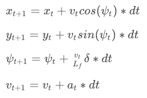

# CarND-Controls-MPC
Self-Driving Car Engineer Nanodegree Program
---
## Model Predictive Control

Model Predictive control is a feedback controller that controls a signal based on optimising a cost function of predicted states.

**Dynamics**

The controller has an internal model of the state dynamics. For this porject the state and actuator dynamics were the following:

State variables: 

1. x_t and y_t - The position coordinates of the vehicle
2. psi_t - The vehicle angle
3. v_t - The velocity of the vehicle

Actuator variables:

1. delta_t - The vehicle steering angle
2. a_t - The vehicle acceleration. 


<a name="https://classroom.udacity.com/nanodegrees/nd013/">1</a>

**Parameters**

***Prediction Horizon***

MPC requires that the Prediction horizon be tuned. The prediction horizon how far in the future the controller needs to predict and optimize. It is composed of two parameters the Number of predicted states (N) and the time increments (dt) be tuned. 

The prediction horizon for the vehicle was chose as 1 second. Any larger and the vehicle would run of th eroad because it could not handle sudden changes such as curves. 

N was selected as 10 and dt was selected as 0.1. When larger values (such as 15,20) of N were chosen (and smaller values of dt to compensate), the vehicle would become unstable as it kept on trying to adjust it's trajectory too frequently. 
When dt (0.2 sec) was increased and N was decreased (5) the vehicle was able to make it around the track but eventually became unstable.

***Cost function***

The cost function were defined using the follwing parameters:

1. Cross Track Error and the angle error - Penalize the system for not having the vehicle on path
2. Using the actuators - Penalize the system for using the actuators too much
3. The derivative of the actuator signal - Penalize the system for fast actuation. Encourages smoother movement.

Adding multiplication weights were manually chosen to improve performance. 

**Preprocessing and Polynomial Fitting**

The waypoints are prepocessed using a coordinate transform to rotate the coordinates to the vehicle's reference frame.
The points are then fitted to a 3rd degree polynomial.

**Model Predictive Control with Latency**

To handle the latency of 100ms by calculating the state of the vehicle after 100ms had elapsed. This is the state that MPC receives and has to solve for.


## Dependencies

* cmake >= 3.5
 * All OSes: [click here for installation instructions](https://cmake.org/install/)
* make >= 4.1(mac, linux), 3.81(Windows)
  * Linux: make is installed by default on most Linux distros
  * Mac: [install Xcode command line tools to get make](https://developer.apple.com/xcode/features/)
  * Windows: [Click here for installation instructions](http://gnuwin32.sourceforge.net/packages/make.htm)
* gcc/g++ >= 5.4
  * Linux: gcc / g++ is installed by default on most Linux distros
  * Mac: same deal as make - [install Xcode command line tools]((https://developer.apple.com/xcode/features/)
  * Windows: recommend using [MinGW](http://www.mingw.org/)
* [uWebSockets](https://github.com/uWebSockets/uWebSockets)
  * Run either `install-mac.sh` or `install-ubuntu.sh`.
  * If you install from source, checkout to commit `e94b6e1`, i.e.
    ```
    git clone https://github.com/uWebSockets/uWebSockets
    cd uWebSockets
    git checkout e94b6e1
    ```
    Some function signatures have changed in v0.14.x. See [this PR](https://github.com/udacity/CarND-MPC-Project/pull/3) for more details.

* **Ipopt and CppAD:** Please refer to [this document](https://github.com/udacity/CarND-MPC-Project/blob/master/install_Ipopt_CppAD.md) for installation instructions.
* [Eigen](http://eigen.tuxfamily.org/index.php?title=Main_Page). This is already part of the repo so you shouldn't have to worry about it.
* Simulator. You can download these from the [releases tab](https://github.com/udacity/self-driving-car-sim/releases).
* Not a dependency but read the [DATA.md](./DATA.md) for a description of the data sent back from the simulator.


## Basic Build Instructions

1. Clone this repo.
2. Make a build directory: `mkdir build && cd build`
3. Compile: `cmake .. && make`
4. Run it: `./mpc`.